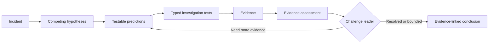
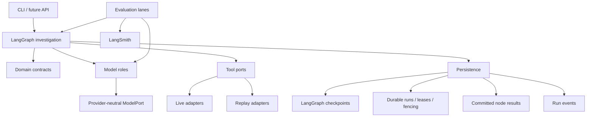

<div align="center">

# AI Incident Commander

**Evidence-driven incident investigation with deterministic control, durable execution, and measurable model quality.**

[](https://github.com/serhii-baksheiev/ai-incident-commander/actions/workflows/ci.yml)
[](LICENSE)


[Architecture](docs/incident-commander-architecture-v1.md) ·
[Integration boundary](docs/decisions/integration-boundary.md) ·
[Durable execution ADR](docs/decisions/durable-run-execution.md) ·
[Evidence](docs/evidence) ·
[Journal](journal/README.md)

</div>

---

AI Incident Commander (AIC) is a stateful investigation system for operational incidents.

It does not ask an LLM to "solve the incident" in one opaque step. AIC keeps the control flow explicit: it forms competing hypotheses, derives falsifiable predictions, executes typed investigation tests, preserves raw evidence separately from interpretation, challenges the leading explanation, and stops through deterministic rules.

> **The graph controls the investigation. The model supplies judgement. Evidence controls what can be claimed. Evals decide whether a change was an improvement.**

## Why this exists

Most agentic incident-response demos make it difficult to answer basic engineering questions:

- Why did the system believe this root cause?
- Which evidence actually supports it?
- Did a retry repeat an external call?
- Can the run survive a worker crash?
- Did the new prompt really improve anything?
- Is the model better because of the graph, or would one good prompt do just as well?

AIC is built around those questions.

The project intentionally favors **traceability, replayability, explicit failure modes, and measurable evidence** over autonomous "magic".

## Investigation loop



The model participates in semantic judgement. It does **not** own executable tools, persistence, budgets, worker ownership, or termination policy.

## Architecture at a glance



### Core boundaries

- **LangGraph owns orchestration state** — graph topology, routing, interruption, checkpoint/resume.
- **Domain stays framework-free** — core contracts do not depend on LangGraph or model providers.
- **Model roles return structured judgement** — provider access is behind a narrow `ModelPort`.
- **Tools are typed and replayable** — live observations and deterministic replay share the same contract.
- **External results can be committed before checkpoints** — replay reuses a committed result instead of calling the provider/tool twice.
- **PostgreSQL coordinates durable execution** — runs, leases, fencing, recovery metadata, node results, and events share one transactional substrate.
- **Evaluation is part of the architecture** — model/prompt/graph changes are accepted only with versioned evidence.

## Durable execution

AIC treats a logical investigation run as durable state, not as a process.

The current durable execution design uses:

- `runs` with `queued / running / waiting_human / completed / failed`;
- atomic `FOR UPDATE SKIP LOCKED` worker claims;
- leases, heartbeats, bounded recovery, and fencing;
- semantic `exec_key` values that do **not** include worker-attempt identity;
- immutable committed `node_results`;
- a `FencedCheckpointer` that rejects stale writes;
- append-only run evidence/events.

A crash after an external call but before the next checkpoint must not cause the same logical operation to run again.

```text
external call
    ↓
commit result under exec_key
    ↓
checkpoint catches up
```

On recovery, the same `exec_key` reuses the committed result.

A deliberate re-observation is different: it creates a new logical operation and a new key.

The design record is in [docs/decisions/durable-run-execution.md](docs/decisions/durable-run-execution.md). It is Accepted: its architecture proof, the deterministic **T-4 race matrix** in AIC-57, passed, and the record states what the matrix measured and what it does not cover.

## Evaluation philosophy

AIC does not treat a green test suite as evidence that a model is good.

The repository separates:

1. **deterministic regression tests** — no real provider calls;
2. **replay benchmark evaluation** — fixed scenarios and versioned ground truth;
3. **live model evaluation** — real model judgement behind the provider-neutral role layer;
4. **one-shot hold-out** — final evidence for a candidate fingerprint;
5. **LangSmith publication** — native run/evaluator evidence when explicitly requested.

### Four-arm benchmark

The live-model calibration lane (`npm run eval:live-model`) runs four arms over the same corpus, and the comparison was [preregistered](docs/evidence/preregistration/v0.2-four-arm.md) before any paid calibration run containing the naive arm:

| Arm | Purpose |
| --- | --- |
| Scripted control | Negative/control signal for harness regressions |
| Oracle | Positive control proving an evaluator can reach its claimed optimum |
| Naive | Same model, one prompt, same available telemetry, no graph |
| Graph + model | The AIC architecture under test |

The important comparison is:

> **Does the graph make the same model perform better than a single prompt over the same telemetry?**

Recent v0.2 repair work added:

- an evaluator-side Oracle positive control;
- structural evidence matching by stable evidence identity;
- a closed, versioned root-cause taxonomy for comparable evaluation;
- opaque benchmark incident IDs so scenario labels do not leak into prompts;
- a naive single-prompt model role with no graph dependency.

The accepted historical evaluator remains readable; new scoring semantics are versioned rather than silently rewriting old evidence.

## Benchmark policy

The replay corpus contains ten scenarios.

- **8 calibration scenarios** are available for diagnosis and iteration.
- **2 hold-out scenarios** are excluded from tuning.
- Final hold-out execution is guarded by a **candidate fingerprint**.
- A failed/consumed hold-out is not rerun merely to get a better result.
- Metrics are reported individually; no composite score is allowed to hide a regression.

Ground truth stays on the evaluator side. Benchmark execution callbacks receive a ground-truth-free projection rather than the full scenario record.

## Project status

AIC is actively evolving beyond the original v0.1 kernel.

| Area | Status |
| --- | --- |
| v0.1 Investigation Kernel | Established baseline |
| v0.2 Investigation Quality | Evidence repair / stronger model-vs-baseline evaluation in progress |
| PostgreSQL persistence foundation | Implemented |
| Durable run substrate | Implemented |
| T-4 FencedCheckpointer proof | Passed; the durable-run design record is Accepted |
| Safe Operations | Next major product capability |
| Knowledge / RAG | Planned after v0.3 gate |
| Long-term memory | Conditional on a measured learning objective |
| Production UI | Deferred to the v1 design gate |

The v0.1 architecture is a frozen baseline. Later structural changes are expected to be justified by measured evidence, failed invariants, or implementation constraints.

## Repository structure

```text
apps/cli                  command-line entrypoint
packages/domain           framework-free domain contracts
packages/graph            LangGraph state, nodes, edges, routing
packages/roles            semantic roles and provider-neutral model port
packages/tools            live + replay tool adapters
packages/persistence      checkpoints, PostgreSQL app schema, durable run store
packages/evals            benchmarks, evaluators, experiment lanes
packages/observability    trace and run metadata
datasets/scenarios        scenario notes (fixtures live in packages/evals)
incident-lab              isolated live incident environment
infra/postgres            PostgreSQL live-lane / CI support
docs/decisions            architecture decision records
docs/evidence             committed evaluation evidence
```

Architecture boundaries are enforced with TypeScript, ESLint, Dependency Cruiser, and targeted mutation/non-vacuity tests.

## Quick start

Requirements:

- Node.js **22+**
- npm **10+**

```bash
git clone https://github.com/serhii-baksheiev/ai-incident-commander.git
cd ai-incident-commander

npm ci
npm run check
```

`npm run check` runs:

```text
architecture lint
→ TypeScript build
→ full deterministic test suite
```

The normal test suite does not call the real model provider.

### CLI

```bash
npm run build

npm run cli -- --help
npm run cli -- start --run-id demo --checkpoint ./checkpoints.sqlite
npm run cli -- resume --run-id demo --checkpoint ./checkpoints.sqlite
```

### PostgreSQL live lane

CI runs the bounded PostgreSQL lane automatically.

For local work:

```bash
# Start PostgreSQL using infra/postgres/compose.yaml, then:
npm run test:live-postgres
```

The CI service container is pinned by digest and uses loopback-only trust auth for the ephemeral test database.

## Live model evaluation

AIC's model-facing code uses a provider-neutral `ModelPort`. The reference adapter currently reads an Anthropic credential at the executable boundary.

```bash
export ANTHROPIC_API_KEY=<your key>

# optional model override
export AIC_REFERENCE_MODEL_ID=<model id>

npm run eval:live-model
```

The repeatable live-model command is for **calibration**, not hold-out tuning.

The Oracle positive control needs no credential and refuses provider calls (`fetch`) while it runs; it scores answers projected from ground truth over the calibration partition only:

```bash
npm run eval:oracle
```

The one-shot final path is:

```bash
npm run eval:final-holdout
```

Do not use the final command as a connectivity probe.

## LangSmith

Tracing is off by default.

```bash
export LANGSMITH_TRACING=true
export LANGSMITH_API_KEY=<your key>
export LANGSMITH_PROJECT=ai-incident-commander
```

For EU workspaces:

```bash
export LANGSMITH_ENDPOINT=https://eu.api.smith.langchain.com
```

Evaluation publication is opt-in. Local evaluation can run without publishing.

When tracing is enabled, investigation state may contain incident data and evidence text. Treat enabling third-party tracing as an explicit data-handling decision.

## Safety and failure semantics

AIC deliberately keeps several distinctions visible:

- **unavailable tool ≠ negative evidence**
- **replay ≠ re-observation**
- **model refusal ≠ metric value 0**
- **not applicable ≠ withheld**
- **worker lease ≠ permission to commit after fencing authority is stale**
- **checkpoint persistence ≠ exactly-once external execution**
- **a plausible answer ≠ an evidence-supported conclusion**

These distinctions are part of the product, not implementation trivia.

## Roadmap

### v0.1 — Investigation Kernel

- canonical investigation domain;
- persistent checkpoint/resume;
- read-only tools;
- record/replay;
- mandatory challenge;
- deterministic termination;
- reproducible evaluation.

### v0.2 — Investigation Quality

- larger benchmark;
- reference-model roles;
- richer evaluators;
- hold-out policy;
- Oracle + naive baseline work;
- structural evaluation repair.

### v0.3 — Safe Operations

- `ProposedAction`;
- tool risk registry;
- human approval;
- idempotency;
- revalidation before mutation;
- `SAFE_WRITE`;
- action outcome becomes Evidence.

### v0.4 — Knowledge

RAG over runbooks, ADRs, postmortems, and operational docs as an explicit controlled input.

### v0.5 — Long-term Memory

Conditional. Memory is added only if a concrete learning objective and leakage-safe evaluation justify it.

### v1 — Production

- production run service;
- auth/RBAC;
- resilience and operational policies;
- production API;
- deployment/DR;
- investigation UI.

The UI design gate is intentionally late: backend/domain contracts should exist before the product surface invents its own orchestration model.

## Documentation

| Document | Purpose |
| --- | --- |
| [Architecture v1](docs/incident-commander-architecture-v1.md) | Canonical domain, graph, tool, evaluation, and roadmap baseline |
| [Integration boundary](docs/decisions/integration-boundary.md) | Service × Environment integration model |
| [Durable run execution](docs/decisions/durable-run-execution.md) | PostgreSQL ownership, fencing, committed execution, recovery |
| [v0.2 exit gate](docs/v0.2-exit-gate.md) | Current v0.2 acceptance evidence and gate history |
| [Evidence](docs/evidence) | Versioned calibration, Oracle, preregistration, and final evaluation artifacts |
| [Journal](journal/README.md) | Human-readable development history |
| [PLAN.md](PLAN.md) | Standing execution/process conventions |

## Engineering principles

- **Red → Green → Refactor**
- Prefer deterministic contracts over prompt folklore.
- Preserve old evidence; version changed semantics.
- Prove load-bearing tests can actually fail.
- Keep public CI safe for untrusted pull requests.
- Avoid speculative infrastructure.
- Let evidence reopen architecture decisions when necessary.

## License

[MIT](LICENSE) © 2026 Serhii Baksheiev.
