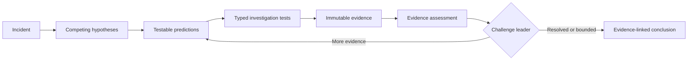

<div align="center">
  <h1>AI Incident Commander</h1>
  <p><strong>Evidence-driven, replayable incident investigation built around deterministic control.</strong></p>
  <p>
    Architecture frozen for v0.1 · TypeScript · LangGraph · LangChain · LangSmith
  </p>
  <p>
    <a href="docs/incident-commander-architecture-v1.md">Architecture v1</a>
    ·
    <a href="https://sbaksheiev.atlassian.net/jira/software/projects/AIC/boards">Jira project</a>
  </p>
</div>

---

AI Incident Commander is designed as a stateful investigation system for operational incidents. It forms competing hypotheses, derives falsifiable predictions, runs typed investigation tests, preserves raw evidence separately from interpretation, challenges its leading explanation, and stops through deterministic rules.

The goal is not an autonomous remediation swarm. The goal is a disciplined investigation kernel whose conclusions can be traced to evidence, resumed after interruption, replayed against fixed scenarios, and measured before changes are accepted.

## Investigation loop



## Architectural thesis

> **The graph controls the investigation. The model supplies judgement. Evidence controls what can be claimed. Evals decide whether a change was an improvement.**

Four boundaries make that thesis concrete:

- **LangGraph owns orchestration** — state, routing, persistence, interruption, and recovery.
- **LLM nodes return structured judgement** — they do not own executable tools.
- **Deterministic nodes own side effects** — tool execution, evidence creation, budgets, challenge routing, and termination.
- **Replayable evaluation gates change** — prompt, graph, and tool-semantic changes require evidence tied to the tested revision.

## v0.1 — Investigation Kernel

| Capability | v0.1 commitment |
| --- | --- |
| Domain | Incident → Hypothesis → Prediction → Test → Trial → Evidence → Conclusion |
| Tools | Read-only live adapters plus deterministic replay adapters |
| Control | Mandatory challenge, bounded budgets, deterministic termination |
| Recovery | Persistent checkpoints with duplicate-safe resume semantics |
| Evaluation | Five replay scenarios, repeated runs, LangSmith experiments, mutation-verified gates |
| Human input | Optional conclusion review through interrupt and resume |

Deliberate non-goals for v0.1 include write actions, autonomous remediation, multi-agent swarms, RAG, long-term memory, production API/worker topology, and a production UI.

## Project status

| Area | Status |
| --- | --- |
| Architecture | **Frozen for v0.1 implementation** |
| Repository and engineering guardrails | Scaffolded; Definition-of-Done command gate not configured |
| Product implementation | Canonical domain contracts implemented; read-only tool registry with live and replay adapters implemented — see [`round-trips every canonical contract through public schemas`](test/domain-contract.test.mjs) and [`replays a recorded live response without invoking the live tool again`](test/tool-registry-replay.test.mjs); graph behavior not started |
| Scaffold milestone | [AIC-2 — scaffold repository and enforce architecture boundaries](https://sbaksheiev.atlassian.net/browse/AIC-2) |
| Completed implementation milestone | [AIC-3 — canonical domain types and IncidentState](https://sbaksheiev.atlassian.net/browse/AIC-3) |
| Completed implementation milestone | [AIC-5 — read-only tool registry and live record / replay adapters](https://sbaksheiev.atlassian.net/browse/AIC-5) |
| Next implementation milestone | [AIC-4 — persistent checkpointer and kill/resume](https://sbaksheiev.atlassian.net/browse/AIC-4) |

The architecture freeze means structural changes must be justified by benchmark evidence, an implementation constraint, or a failed invariant—not by another speculative design round.

## Documentation

| Document | Purpose |
| --- | --- |
| [Architecture v1](docs/incident-commander-architecture-v1.md) | Canonical domain contracts, graph topology, persistence, tools, evals, roadmap, and Definition of Done |
| [PLAN.md](PLAN.md) | Local agent/operator queues and standing execution state |
| [Journal](journal/README.md) | Human-readable run history and journal conventions |
| [Self-hosted runner](RUNNER.md) | Linux ARM64 CI VM on an Apple Silicon macOS host, security boundary, and operations |

## Repository shape

```text
apps/cli                  command-line entrypoint
packages/domain           framework-free domain contracts
packages/graph            LangGraph state, nodes, edges, and routing
packages/roles            semantic roles and prompts
packages/tools            live and replay tool adapters
packages/persistence      checkpointing and recovery
packages/evals            deterministic and LangSmith evaluation gates
packages/observability    trace and run metadata
datasets/scenarios        versioned replay fixtures
incident-lab              isolated live incident environment
```

The dependency direction is intentionally one-way: `domain` imports no LangChain or LangGraph code; graph and tools depend on the domain rather than the reverse. Dependency Cruiser checks the module graph, ESLint limits dynamic loading in `packages/domain`, and small deterministic checks cover the domain manifest and TypeScript configuration.

## Engineering workflow

Work is tracked in the [AIC Jira project](https://sbaksheiev.atlassian.net/jira/software/projects/AIC/boards) and delivered with strict Red–Green–Refactor TDD. Rig is present only as an engineering guardrail; LangGraph remains the sole owner of application orchestration.

From a clean checkout:

```bash
npm ci
npm run lint
npm run build
npm test
npm run cli -- --help
```
