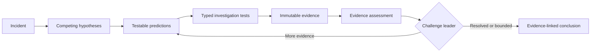

<div align="center">
  <h1>AI Incident Commander</h1>
  <p><strong>Evidence-driven, replayable incident investigation built around deterministic control.</strong></p>
  <p>
    Architecture frozen for v0.1 · TypeScript · LangGraph · LangChain · LangSmith
  </p>
  <p>
    <a href="docs/incident-commander-architecture-v1.md">Architecture v1</a>
    ·
    <a href="https://sbaksheiev.atlassian.net/jira/software/projects/AIC/boards">Jira project</a>
  </p>
</div>

---

AI Incident Commander is designed as a stateful investigation system for operational incidents. It forms competing hypotheses, derives falsifiable predictions, runs typed investigation tests, preserves raw evidence separately from interpretation, challenges its leading explanation, and stops through deterministic rules.

The goal is not an autonomous remediation swarm. The goal is a disciplined investigation kernel whose conclusions can be traced to evidence, resumed after interruption, replayed against fixed scenarios, and measured before changes are accepted.

## Investigation loop



## Architectural thesis

> **The graph controls the investigation. The model supplies judgement. Evidence controls what can be claimed. Evals decide whether a change was an improvement.**

Four boundaries make that thesis concrete:

- **LangGraph owns orchestration** — state, routing, persistence, interruption, and recovery.
- **LLM nodes return structured judgement** — they do not own executable tools.
- **Deterministic nodes own side effects** — tool execution, evidence creation, budgets, challenge routing, and termination.
- **Replayable evaluation gates change** — prompt, graph, and tool-semantic changes require evidence tied to the tested revision.

## v0.1 — Investigation Kernel

| Capability | v0.1 commitment |
| --- | --- |
| Domain | Incident → Hypothesis → Prediction → Test → Trial → Evidence → Conclusion |
| Tools | Read-only live adapters plus deterministic replay adapters |
| Control | Mandatory challenge, bounded budgets, deterministic termination |
| Recovery | Persistent checkpoints with duplicate-safe resume semantics |
| Evaluation | Five replay scenarios, repeated runs, LangSmith experiments, mutation-verified gates |
| Human input | Optional conclusion review through interrupt and resume |

Deliberate non-goals for v0.1 include write actions, autonomous remediation, multi-agent swarms, RAG, long-term memory, production API/worker topology, and a production UI.

## Project status

| Area | Status |
| --- | --- |
| Architecture | **Frozen for v0.1 implementation** |
| Repository scaffold | Present — see `test/repository-scaffold.test.mjs` › "scaffolds every v0.1 repository area without an agents product package" |
| Architecture boundaries | Enforced — see `test/repository-scaffold.test.mjs` › "lint rejects a domain import from LangChain" and › "lint rejects a domain import from graph" |
| Next implementation milestone | [AIC-3 — canonical domain types and IncidentState](https://sbaksheiev.atlassian.net/browse/AIC-3) |

The architecture freeze means structural changes must be justified by benchmark evidence, an implementation constraint, or a failed invariant—not by another speculative design round.

## Documentation

| Document | Purpose |
| --- | --- |
| [Architecture v1](docs/incident-commander-architecture-v1.md) | Canonical domain contracts, graph topology, persistence, tools, evals, roadmap, and Definition of Done |
| [PLAN.md](PLAN.md) | Local agent/operator queues and standing execution state |
| [Journal](journal/README.md) | Human-readable run history and journal conventions |
| [Self-hosted runner](RUNNER.md) | Linux ARM64 CI VM on an Apple Silicon macOS host, security boundary, and operations |

## Repository shape

The directories below are reserved scaffold boundaries. AIC-2 establishes their paths and dependency direction; it does not claim their planned product content is already implemented.

Following tickets add the domain contracts, graph nodes and routing, roles and prompts, live and replay tool adapters, checkpointing and recovery, evaluation gates, tracing, replay scenarios, and the Incident Lab surface.

```text
apps/cli                  minimal command-line entrypoint
packages/domain           reserved domain layer
packages/graph            reserved orchestration layer
packages/roles            reserved semantic-role layer
packages/tools            reserved tool boundary
packages/persistence      reserved persistence layer
packages/evals            reserved evaluation layer
packages/observability    reserved observability layer
datasets/scenarios        reserved replay-scenario boundary
incident-lab              reserved live-investigation boundary
```

The dependency direction is intentionally one-way: `domain` imports no LangChain or LangGraph code; graph, tools, and evals depend on the domain rather than the reverse.

## Local checks

The command and lockfile contract is pinned by `test/repository-scaffold.test.mjs` › "publishes one clean-install build, lint, test, and CLI command contract". CI ordering is pinned by the same file › "runs CI lint, build, and tests from a clean npm install"; build and boot are exercised by › "builds the TypeScript workspace through its public root command" and › "boots the minimal CLI through its public root command".

```bash
npm ci
npm run lint
npm run build
npm test
npm run cli -- --help
```

## Engineering workflow

Work is tracked in the [AIC Jira project](https://sbaksheiev.atlassian.net/jira/software/projects/AIC/boards) and delivered with strict Red–Green–Refactor TDD. Rig is present only as an engineering guardrail; LangGraph remains the sole owner of application orchestration.
