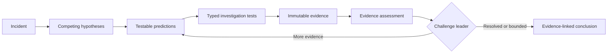

<div align="center">
  <h1>AI Incident Commander</h1>
  <p><strong>Evidence-driven, replayable incident investigation built around deterministic control.</strong></p>
  <p>
    Architecture frozen for v0.1 · TypeScript · LangGraph · LangChain · LangSmith
  </p>
  <p>
    <a href="docs/incident-commander-architecture-v1.md">Architecture v1</a>
    ·
    <a href="https://sbaksheiev.atlassian.net/jira/software/projects/AIC/boards">Jira project</a>
  </p>
</div>

---

AI Incident Commander is designed as a stateful investigation system for operational incidents. It forms competing hypotheses, derives falsifiable predictions, runs typed investigation tests, preserves raw evidence separately from interpretation, challenges its leading explanation, and stops through deterministic rules.

The goal is not an autonomous remediation swarm. The goal is a disciplined investigation kernel whose conclusions can be traced to evidence, resumed after interruption, replayed against fixed scenarios, and measured before changes are accepted.

## Investigation loop



## Architectural thesis

> **The graph controls the investigation. The model supplies judgement. Evidence controls what can be claimed. Evals decide whether a change was an improvement.**

Four boundaries make that thesis concrete:

- **LangGraph owns orchestration** — state, routing, persistence, interruption, and recovery.
- **LLM nodes return structured judgement** — they do not own executable tools.
- **Deterministic nodes own side effects** — tool execution, evidence creation, budgets, challenge routing, and termination.
- **Replayable evaluation gates change** — prompt, graph, and tool-semantic changes require evidence tied to the tested revision.

## v0.1 — Investigation Kernel

| Capability | v0.1 commitment |
| --- | --- |
| Domain | Incident → Hypothesis → Prediction → Test → Trial → Evidence → Conclusion |
| Tools | Read-only live adapters plus deterministic replay adapters |
| Control | Mandatory challenge, bounded budgets, deterministic termination |
| Recovery | Persistent checkpoints with duplicate-safe resume semantics |
| Evaluation | Five replay scenarios, repeated runs, LangSmith experiments, mutation-verified gates |
| Human input | Optional conclusion review through interrupt and resume |

Deliberate non-goals for v0.1 include write actions, autonomous remediation, multi-agent swarms, RAG, long-term memory, production API/worker topology, and a production UI.

## v0.2 benchmark policy

The replay corpus contains ten scenarios. Eight are calibration cases available
to prompt/model iteration; `incomplete-evidence` and
`challenge-changes-leader` are the declared hold-out cases. Calibration and
final-evaluation execution accept no caller-supplied scenario list: each derives
its complete corpus from `BENCHMARK_SCENARIO_PARTITIONS`. Caller-selected sets
must use the explicit `ad-hoc` mode, which carries neither calibration nor final
completeness semantics. The original five v0.1 scenarios and their fifteen
stable native example IDs remain the regression floor.

Executable policy proof: `test/benchmark-evaluation.test.mjs` › "declares a
complete non-overlapping calibration and hold-out policy before tuning", ›
"keeps prompt and model iteration off hold-out cases even when they are passed
accidentally", › "includes calibration and hold-out cases in the final
evaluation plan", and › "executes every declared scenario through the
final-evaluation benchmark path", › "rejects an implicit five-scenario mix
containing hold-out before execution", and › "rejects a final-evaluation subset
before execution". Preservation is pinned by
`test/replay-scenarios.test.mjs` ›
"preserves the five accepted v0.1 ground truths and replay fixtures" and
`test/benchmark-evaluation.test.mjs` › "adds stable native identities without
changing the fifteen accepted v0.1 examples".

Benchmark execution callbacks receive `BenchmarkExecutionInput`, an explicit
ground-truth-free projection containing only `experimentId`, `exampleId`,
`runId`, `threadId`, `scenarioId`, the replay fixture, and versioned runtime
metadata. They never receive the full
`BenchmarkRecord` or `IncidentScenario`; those remain on the evaluator,
regression-gate, persistence, and LangSmith dataset/evidence side. This is a
source-level contract boundary, not a capability sandbox: code in the same
process can still import the public replay corpus, but the execution callback
cannot obtain evaluator expectations from its argument.

Executable boundary proof: `test/behavior-evaluators.test.mjs` › "keeps
scenario ground truth outside the investigation execution callback" and ›
"graph benchmark keeps ground truth outside createNodes and records a challenge
with no investigation change".

Behavior-evaluator persistence is additive. Accepted v0.1 records without
`evaluatorVersion` and `behaviorMetrics` remain readable. New records must
declare both fields together, and unknown evaluator versions fail loudly.
Executable compatibility proof: `test/behavior-evaluators.test.mjs` ›
"persists accepted v0.1 records without behavior-evaluator fields", › "rejects
behavior metrics when their evaluator version is absent", and › "rejects an
explicitly unsupported persisted evaluator version".

Resource-evidence persistence is additive on the same terms. A benchmark
evaluation may carry a versioned resource object — one field per axis, no
composite and no derived "recovery overhead". Records carrying none stay
readable, which is what every accepted v0.1 record looks like; a **present**
object at an unknown schema version, or missing a declared dimension, is refused
before the run is created rather than dropped, because a dropped axis reads
downstream as "spent nothing on that axis". Executable compatibility proof:
`test/benchmark-resource-evidence.test.mjs` › "accepts a persisted v0.1
evaluation that carries no resource evidence at all", › "refuses resource
evidence at an unknown schema version before any run is created", and ›
"refuses resource evidence missing ${field} before any run is created".

## Reference model roles and the live evaluation lane

Three investigation roles — `generate_hypotheses`,
`interpret_residual_evidence` and `challenge_hypothesis` — have model-backed
implementations in `packages/roles`, written against a provider-neutral
`ModelPort`. The scripted nodes remain the path for every deterministic unit and
regression test; the model-backed roles are used only by the live lane below.

One reference provider and model are configured explicitly, through
`ANTHROPIC_API_KEY` and the optional `AIC_REFERENCE_MODEL_ID` override.
`resolveModelConfig` takes the environment as an argument and **never returns
the credential**: it reports whether the lane can run and under which model, and
the key is read once, at the executable edge — which holds because no workspace
package reads the process environment at all, checked by
`test/roles-boundary.test.mjs` › "keeps every process-environment read out of the
workspace packages". No provider SDK is installed — the
adapter issues one plain `fetch` with an injected transport, so the whole path
is unit-testable with no network. The graph and domain layers stay
provider-independent, and that is now mechanical on both sides: the
`graph-and-domain-do-not-import-model-providers` rule in
`dependency-cruiser.config.mjs` refuses the import, proven by
`test/repository-scaffold.test.mjs` › "lint rejects a graph import of the model
role package" and › "lint rejects a graph import of a provider sdk". The
provider host and wire format live in exactly one file, held there by
`test/roles-boundary.test.mjs` › "reaches the model provider from exactly one
file in the workspace".

```bash
npm run eval:live-model
npm run eval:live-model -- --control-baseline ./control-baseline.json --out ./lane-report.json
```

> 🔴 **Read everything below in the present tense with this in front of it: no
> model has ever executed these roles in this repository.** There is no provider
> credential in this environment, so every test of this lane and of the three
> roles drives an injected or fetch-stubbed port, and no HTTP request has left
> this machine for a provider. The path is implemented and refuses correctly
> without a credential; it is not evidence that a real model's output satisfies
> the domain schemas, and no model-quality figure, token count or cost figure in
> this repository was produced by a model. AIC-94's acceptance rows 1 and 2 are
> **unproven** on that ground, not met.
>
> The same disclosure is at the top of `packages/evals/src/live-model-lane.ts`,
> `scripts/eval-live-model.mjs`, `test/live-model-lane.test.mjs` and
> `test/roles-model-nodes.test.mjs`.

The lane runs two arms over the accepted hold-out corpus, at one commit, in one
process: a scripted control arm and a model arm that differ only in those three
roles. They are reported separately and per metric, with no composite anywhere.
If the control arm moves against its declared baseline, the regression is in the
harness and the model arm's numbers are marked unreportable; with no declared
baseline the model arm is unreportable for the same reason. Both arms are
bounded by an explicit run cap and completion cap, published in the report.

🔴 **What the control arm can catch is narrower than "it moved".** Measured over
the final-evaluation corpus, the replay-backed control scores a single value of
**zero on every metric it emits**, and zero is the worst score for five of the
six. So it detects a harness change that moves a metric **up**, or that stops
emitting one — and it cannot detect one that pushes a metric further down,
because there is no further down. Read a `harness-regression` verdict as covering
the first direction only, and its absence as saying nothing about the second.
The floor set is asserted rather than described: `test/live-model-lane.test.mjs`
› "measures the harness zero that makes evidence_coverage unreportable".

**What leaves the process.** When a credential is configured, the prompt carries
the investigation state — the incident, hypotheses, predictions, evidence and
assessments — to the configured provider's HTTPS endpoint. That is the only
outbound destination **the lane itself** has; `--publish` adds a second, the
LangSmith ingestion described under *LangSmith tracing* below. It lives in one
file
(`packages/roles/src/reference-model-port.ts`, held to one file by
`test/roles-boundary.test.mjs` › "reaches the model provider from exactly one
file in the workspace" and › "performs the provider request in the adapter and
nowhere else"), and without a credential nothing leaves at all.

Two things the lane deliberately does not do. It **withholds
`evidence_coverage`** from both arms with the reason attached: that evaluator
compares a hand-written ground-truth predicate against an evidence statement as
an exact fingerprint, so any graph-executed run scores zero for a harness reason
rather than a model one — a pre-existing evaluator defect, filed separately, and
publishing the zero would be exactly the confound this lane exists to prevent.
And it **never retries a publication refusal**: LangSmith ingestion can refuse a
write — an exhausted tenant quota is one way — and a refused publication fails
the command rather than being smoothed into a success. Publication is opt-in; without `--publish` the
lane produces its per-metric evidence locally with no ingestion at all.

With no credential the command exits non-zero with a named
`MissingModelCredentialError` and touches nothing — no dataset, no project, no
run, no model call. Executable proof: `test/live-model-lane.test.mjs` ›
"exits non-zero naming the variable when the command is run with no credential"
and › "refuses the lane with the named variable and touches nothing when no
credential is set".

Run identity records what produced it: `modelId` and `modelProvider` are
optional run-metadata fields, and `inputTokensUsed` / `outputTokensUsed` are
optional resource axes at resource schema version 2. All four are optional
because a run with no model has nothing to declare, and a published zero would
be a measured-zero claim rather than an absent measurement. The correspondence
between those types and the persistence allowlists is computed in both
directions by `test/model-run-identity-correspondence.test.mjs`, because a field
added to a type but not to an allowlist is dropped without a word.

## Project status

| Area | Status |
| --- | --- |
| Architecture | **Frozen for v0.1 implementation** |
| Repository and engineering guardrails | Scaffolded; Definition-of-Done command gate not configured |
| Product implementation | Canonical domain contracts, a persistent SQLite checkpointer with a kill/resume spike, and a read-only tool registry with live and replay adapters implemented — see [`resumes the persisted run after process death without duplicate records or budget drift`](test/persistent-resume.test.mjs) and [`replays a recorded live response without invoking the live tool again`](test/tool-registry-replay.test.mjs) |
| Scaffold milestone | [AIC-2 — scaffold repository and enforce architecture boundaries](https://sbaksheiev.atlassian.net/browse/AIC-2) |
| Completed implementation milestone | [AIC-4 — persistent checkpointer and kill/resume](https://sbaksheiev.atlassian.net/browse/AIC-4) |
| Completed implementation milestone | [AIC-5 — read-only tool registry and live record / replay adapters](https://sbaksheiev.atlassian.net/browse/AIC-5) |

The architecture freeze means structural changes must be justified by benchmark evidence, an implementation constraint, or a failed invariant—not by another speculative design round.

## Documentation

| Document | Purpose |
| --- | --- |
| [Architecture v1](docs/incident-commander-architecture-v1.md) | Canonical domain contracts, graph topology, persistence, tools, evals, roadmap, and Definition of Done |
| [PLAN.md](PLAN.md) | Standing execution conventions and the journal pointer; the queue itself is whatever `.claude/queue.json` names, currently Jira |
| [Journal](journal/README.md) | Human-readable run history and journal conventions |
| [Self-hosted runner](RUNNER.md) | Linux ARM64 CI VM on an Apple Silicon macOS host, security boundary, and operations |

## Repository shape

```text
apps/cli                  command-line entrypoint
packages/domain           framework-free domain contracts
packages/graph            LangGraph state, nodes, edges, and routing
packages/roles            semantic roles, prompts, and the reference model port
packages/tools            live and replay tool adapters
packages/persistence      checkpointing and recovery
packages/evals            deterministic and LangSmith evaluation gates
packages/observability    trace and run metadata
datasets/scenarios        versioned replay fixtures
incident-lab              isolated live incident environment
```

The dependency direction is intentionally one-way: `domain` imports no LangChain or LangGraph code; graph and tools depend on the domain rather than the reverse. Dependency Cruiser checks the module graph, ESLint limits dynamic loading in `packages/domain`, and small deterministic checks cover the domain manifest and TypeScript configuration.

## LangSmith tracing

Tracing is **off by default**: the CLI sets no tracing flag the operator did not
set, so an unconfigured shell produces no outbound call — see
`test/langsmith-tracing.test.mjs` › "makes no outbound call when no tracing flag
is set". Enable it per shell:

```bash
export LANGSMITH_TRACING=true
export LANGSMITH_API_KEY=<your key>          # or LANGCHAIN_API_KEY
export LANGSMITH_PROJECT=ai-incident-commander
```

⚠ **EU-region accounts must also set the endpoint**, because the SDK's default
host is the US one (`langsmith/dist/utils/profiles.js`, `DEFAULT_API_URL`):

```bash
export LANGSMITH_ENDPOINT=https://eu.api.smith.langchain.com
```

If every call is refused on authorization, check the region before you suspect
the key: a valid key against the wrong regional host fails the same way an
invalid one does.

**The flag vocabulary is the tracer's, not ours.** `LANGSMITH_TRACING_V2`,
`LANGCHAIN_TRACING_V2`, `LANGSMITH_TRACING` and `LANGCHAIN_TRACING` all enable
tracing, and only the exact value `true` does — matching
`@langchain/core`'s `isTracingEnabled`. See › "enables tracing for every flag
name the langchain tracer honours" and › "reports tracing disabled for a flag
value the langchain tracer rejects". Reading a narrower set than the tracer
would install the tracer while our key check stayed silent.

**What is guaranteed, exactly:** with a tracing flag on and no api key set, the
run stops before any checkpoint is written — › "refuses to start when tracing is
enabled without an api key", which asserts the exit status, the message, and
that the checkpoint file was never created. That is the only delivery failure
detected. A wrong-region endpoint or an unreachable host still produces a run
that completes and reports success, because the tracer reports a rejected send
as a warning rather than failing the run it was tracing. ⚠ Not because delivery
is backgrounded — this CLI disables that (below); the run waits, and then
succeeds anyway.

Runs are named and tagged so traces are filterable: the root run is
`aic-start` / `aic-resume` with tags `aic` and `aic-<command>`, and every graph
step inherits those tags and the `runId` metadata — › "sends a root run named
for the command whose tags and runId every graph step inherits". Because the
process exits as soon as it prints its result, an enabled run also sets
`LANGCHAIN_CALLBACKS_BACKGROUND=false` unless the operator set it, so delivery
blocks on finalization instead of racing exit — › "blocks background trace
delivery so a short-lived run cannot exit before it sends".

**An unreachable endpoint stalls the run by at least the SDK's client timeout,**
which defaults to `timeout_ms` 90 000 (`langsmith/dist/client.js`). How much
longer depends on how the endpoint fails: a refused connection was observed at
~88 s and a host that accepts and never answers at ~121 s. Nothing outside
bounds it: `@langchain/core` constructs that client itself and passes no
timeout. A timeout is not retried — `langsmith/dist/utils/async_caller.js`
rethrows it out of the retry loop — so the stall is one timeout, not four. This
happens with or without blocking delivery. If a traced run appears to hang,
suspect the endpoint before the graph.

**`npm test` is insulated; a bare `node --test` is not.** The `npm test` script
preloads `test/fixtures/no-ambient-tracing.mjs`, which clears the four tracer
flags before any test module loads, and every spawned process is built from the
allow-list in `test/fixtures/child-env.mjs`. Without them a developer with
tracing exported wrote runs into their own workspace on every suite run. That it
no longer happens **under `npm test`** is pinned by › "the preload clears every
flag the langchain tracer reads" and › "runs the compiled CLI with no outbound
call while the parent shell has tracing enabled".

CI is covered by the same preload, because the workflow runs the suite through
`npm test` rather than invoking the runner directly — › "the CI step that runs
the suite goes through npm test, not node --test" reads
`.github/workflows/ci.yml` and refuses a step that would bypass it. That check
matters on a self-hosted runner, which inherits the machine's environment.

⚠ What the preload does **not** clear is `LANGSMITH_API_KEY` itself. That is the
right scope for flag-gated tracing — a key alone traces nothing — but a
`langsmith` `Client` constructed directly reads the key with no flag involved.
`createLangSmithClient()` is such a constructor, and it is what
`persistBenchmarkExperiment(s)` falls back to when the options object carries no
own `client` — so a call that omits it sends through a client holding whatever
key the environment carries. It was a destructuring default until AIC-69; the
operator-facing consequence is the same, and the mechanism is now an own read,
so an INHERITED `client` no longer suppresses the fallback.

The api key reaches neither the process output nor the trace payload — ›
"never prints the api key on stdout or stderr" and › "never sends the api key
inside a trace payload". One operator caution the code cannot enforce: the SDK
copies non-sensitive `LANGSMITH_*`/`LANGCHAIN_*` variables into run metadata,
and `LANGSMITH_RUNS_ENDPOINTS` embeds api keys in its value while matching none
of the SDK's sensitive-name patterns. Do not export it alongside tracing.

**A traced run transmits the whole graph state** — every trial input and every
evidence record, including its `statement`. Today that is synthetic
persistence-spike text; treat sending real incident content to a third party as
a decision to take deliberately, not a side effect of turning tracing on.

## Engineering workflow

Work is tracked in the [AIC Jira project](https://sbaksheiev.atlassian.net/jira/software/projects/AIC/boards) and delivered with strict Red–Green–Refactor TDD. Rig is present only as an engineering guardrail; LangGraph remains the sole owner of application orchestration.

From a clean checkout:

```bash
npm ci
npm run lint
npm run build
npm test
npm run cli -- --help
npm run cli -- start --run-id demo --checkpoint ./checkpoints.sqlite
npm run cli -- resume --run-id demo --checkpoint ./checkpoints.sqlite
```
