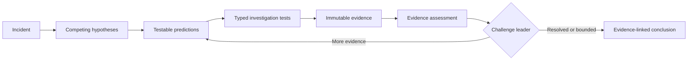

<div align="center">
  <h1>AI Incident Commander</h1>
  <p><strong>Evidence-driven, replayable incident investigation built around deterministic control.</strong></p>
  <p>
    Architecture frozen for v0.1 · TypeScript · LangGraph · LangChain · LangSmith
  </p>
  <p>
    <a href="docs/incident-commander-architecture-v1.md">Architecture v1</a>
    ·
    <a href="https://sbaksheiev.atlassian.net/jira/software/projects/AIC/boards">Jira project</a>
  </p>
</div>

---

AI Incident Commander is designed as a stateful investigation system for operational incidents. It forms competing hypotheses, derives falsifiable predictions, runs typed investigation tests, preserves raw evidence separately from interpretation, challenges its leading explanation, and stops through deterministic rules.

The goal is not an autonomous remediation swarm. The goal is a disciplined investigation kernel whose conclusions can be traced to evidence, resumed after interruption, replayed against fixed scenarios, and measured before changes are accepted.

## Investigation loop



## Architectural thesis

> **The graph controls the investigation. The model supplies judgement. Evidence controls what can be claimed. Evals decide whether a change was an improvement.**

Four boundaries make that thesis concrete:

- **LangGraph owns orchestration** — state, routing, persistence, interruption, and recovery.
- **LLM nodes return structured judgement** — they do not own executable tools.
- **Deterministic nodes own side effects** — tool execution, evidence creation, budgets, challenge routing, and termination.
- **Replayable evaluation gates change** — prompt, graph, and tool-semantic changes require evidence tied to the tested revision.

## v0.1 — Investigation Kernel

| Capability | v0.1 commitment |
| --- | --- |
| Domain | Incident → Hypothesis → Prediction → Test → Trial → Evidence → Conclusion |
| Tools | Read-only live adapters plus deterministic replay adapters |
| Control | Mandatory challenge, bounded budgets, deterministic termination |
| Recovery | Persistent checkpoints with duplicate-safe resume semantics |
| Evaluation | Five replay scenarios, repeated runs, LangSmith experiments, mutation-verified gates |
| Human input | Optional conclusion review through interrupt and resume |

Deliberate non-goals for v0.1 include write actions, autonomous remediation, multi-agent swarms, RAG, long-term memory, production API/worker topology, and a production UI.

## v0.2 benchmark policy

The replay corpus contains ten scenarios. Eight are calibration cases available
to prompt/model iteration; `incomplete-evidence` and
`challenge-changes-leader` are the declared hold-out cases. Calibration and
final-evaluation execution accept no caller-supplied scenario list: each derives
its complete corpus from `BENCHMARK_SCENARIO_PARTITIONS`. Caller-selected sets
must use the explicit `ad-hoc` mode, which carries neither calibration nor final
completeness semantics. The original five v0.1 scenarios and their fifteen
stable native example IDs remain the regression floor.

Executable policy proof: `test/benchmark-evaluation.test.mjs` › "declares a
complete non-overlapping calibration and hold-out policy before tuning", ›
"keeps prompt and model iteration off hold-out cases even when they are passed
accidentally", › "includes calibration and hold-out cases in the final
evaluation plan", and › "executes every declared scenario through the
final-evaluation benchmark path", › "rejects an implicit five-scenario mix
containing hold-out before execution", and › "rejects a final-evaluation subset
before execution". Preservation is pinned by
`test/replay-scenarios.test.mjs` ›
"preserves the five accepted v0.1 ground truths and replay fixtures" and
`test/benchmark-evaluation.test.mjs` › "adds stable native identities without
changing the fifteen accepted v0.1 examples".

## Project status

| Area | Status |
| --- | --- |
| Architecture | **Frozen for v0.1 implementation** |
| Repository and engineering guardrails | Scaffolded; Definition-of-Done command gate not configured |
| Product implementation | Canonical domain contracts, a persistent SQLite checkpointer with a kill/resume spike, and a read-only tool registry with live and replay adapters implemented — see [`resumes the persisted run after process death without duplicate records or budget drift`](test/persistent-resume.test.mjs) and [`replays a recorded live response without invoking the live tool again`](test/tool-registry-replay.test.mjs) |
| Scaffold milestone | [AIC-2 — scaffold repository and enforce architecture boundaries](https://sbaksheiev.atlassian.net/browse/AIC-2) |
| Completed implementation milestone | [AIC-4 — persistent checkpointer and kill/resume](https://sbaksheiev.atlassian.net/browse/AIC-4) |
| Completed implementation milestone | [AIC-5 — read-only tool registry and live record / replay adapters](https://sbaksheiev.atlassian.net/browse/AIC-5) |

The architecture freeze means structural changes must be justified by benchmark evidence, an implementation constraint, or a failed invariant—not by another speculative design round.

## Documentation

| Document | Purpose |
| --- | --- |
| [Architecture v1](docs/incident-commander-architecture-v1.md) | Canonical domain contracts, graph topology, persistence, tools, evals, roadmap, and Definition of Done |
| [PLAN.md](PLAN.md) | Local agent/operator queues and standing execution state |
| [Journal](journal/README.md) | Human-readable run history and journal conventions |
| [Self-hosted runner](RUNNER.md) | Linux ARM64 CI VM on an Apple Silicon macOS host, security boundary, and operations |

## Repository shape

```text
apps/cli                  command-line entrypoint
packages/domain           framework-free domain contracts
packages/graph            LangGraph state, nodes, edges, and routing
packages/roles            semantic roles and prompts
packages/tools            live and replay tool adapters
packages/persistence      checkpointing and recovery
packages/evals            deterministic and LangSmith evaluation gates
packages/observability    trace and run metadata
datasets/scenarios        versioned replay fixtures
incident-lab              isolated live incident environment
```

The dependency direction is intentionally one-way: `domain` imports no LangChain or LangGraph code; graph and tools depend on the domain rather than the reverse. Dependency Cruiser checks the module graph, ESLint limits dynamic loading in `packages/domain`, and small deterministic checks cover the domain manifest and TypeScript configuration.

## LangSmith tracing

Tracing is **off by default**: the CLI sets no tracing flag the operator did not
set, so an unconfigured shell produces no outbound call — see
`test/langsmith-tracing.test.mjs` › "makes no outbound call when no tracing flag
is set". Enable it per shell:

```bash
export LANGSMITH_TRACING=true
export LANGSMITH_API_KEY=<your key>          # or LANGCHAIN_API_KEY
export LANGSMITH_PROJECT=ai-incident-commander
```

⚠ **EU-region accounts must also set the endpoint**, because the SDK's default
host is the US one (`langsmith/dist/utils/profiles.js`, `DEFAULT_API_URL`):

```bash
export LANGSMITH_ENDPOINT=https://eu.api.smith.langchain.com
```

If every call is refused on authorization, check the region before you suspect
the key: a valid key against the wrong regional host fails the same way an
invalid one does.

**The flag vocabulary is the tracer's, not ours.** `LANGSMITH_TRACING_V2`,
`LANGCHAIN_TRACING_V2`, `LANGSMITH_TRACING` and `LANGCHAIN_TRACING` all enable
tracing, and only the exact value `true` does — matching
`@langchain/core`'s `isTracingEnabled`. See › "enables tracing for every flag
name the langchain tracer honours" and › "reports tracing disabled for a flag
value the langchain tracer rejects". Reading a narrower set than the tracer
would install the tracer while our key check stayed silent.

**What is guaranteed, exactly:** with a tracing flag on and no api key set, the
run stops before any checkpoint is written — › "refuses to start when tracing is
enabled without an api key", which asserts the exit status, the message, and
that the checkpoint file was never created. That is the only delivery failure
detected. A wrong-region endpoint or an unreachable host still produces a run
that completes and reports success, because the tracer reports a rejected send
as a warning rather than failing the run it was tracing. ⚠ Not because delivery
is backgrounded — this CLI disables that (below); the run waits, and then
succeeds anyway.

Runs are named and tagged so traces are filterable: the root run is
`aic-start` / `aic-resume` with tags `aic` and `aic-<command>`, and every graph
step inherits those tags and the `runId` metadata — › "sends a root run named
for the command whose tags and runId every graph step inherits". Because the
process exits as soon as it prints its result, an enabled run also sets
`LANGCHAIN_CALLBACKS_BACKGROUND=false` unless the operator set it, so delivery
blocks on finalization instead of racing exit — › "blocks background trace
delivery so a short-lived run cannot exit before it sends".

**An unreachable endpoint stalls the run by at least the SDK's client timeout,**
which defaults to `timeout_ms` 90 000 (`langsmith/dist/client.js`). How much
longer depends on how the endpoint fails: a refused connection was observed at
~88 s and a host that accepts and never answers at ~121 s. Nothing outside
bounds it: `@langchain/core` constructs that client itself and passes no
timeout. A timeout is not retried — `langsmith/dist/utils/async_caller.js`
rethrows it out of the retry loop — so the stall is one timeout, not four. This
happens with or without blocking delivery. If a traced run appears to hang,
suspect the endpoint before the graph.

**`npm test` is insulated; a bare `node --test` is not.** The `npm test` script
preloads `test/fixtures/no-ambient-tracing.mjs`, which clears the four tracer
flags before any test module loads, and every spawned process is built from the
allow-list in `test/fixtures/child-env.mjs`. Without them a developer with
tracing exported wrote runs into their own workspace on every suite run. That it
no longer happens **under `npm test`** is pinned by › "the preload clears every
flag the langchain tracer reads" and › "runs the compiled CLI with no outbound
call while the parent shell has tracing enabled".

CI is covered by the same preload, because the workflow runs the suite through
`npm test` rather than invoking the runner directly — › "the CI step that runs
the suite goes through npm test, not node --test" reads
`.github/workflows/ci.yml` and refuses a step that would bypass it. That check
matters on a self-hosted runner, which inherits the machine's environment.

⚠ What the preload does **not** clear is `LANGSMITH_API_KEY` itself. That is the
right scope for flag-gated tracing — a key alone traces nothing — but a
`langsmith` `Client` constructed directly reads the key with no flag involved.
`createLangSmithClient()` is such a constructor, and it is the default value of
the `client` parameter on `persistBenchmarkExperiment(s)` — so a call that omits
that argument sends through a client holding whatever key the environment
carries.

The api key reaches neither the process output nor the trace payload — ›
"never prints the api key on stdout or stderr" and › "never sends the api key
inside a trace payload". One operator caution the code cannot enforce: the SDK
copies non-sensitive `LANGSMITH_*`/`LANGCHAIN_*` variables into run metadata,
and `LANGSMITH_RUNS_ENDPOINTS` embeds api keys in its value while matching none
of the SDK's sensitive-name patterns. Do not export it alongside tracing.

**A traced run transmits the whole graph state** — every trial input and every
evidence record, including its `statement`. Today that is synthetic
persistence-spike text; treat sending real incident content to a third party as
a decision to take deliberately, not a side effect of turning tracing on.

## Engineering workflow

Work is tracked in the [AIC Jira project](https://sbaksheiev.atlassian.net/jira/software/projects/AIC/boards) and delivered with strict Red–Green–Refactor TDD. Rig is present only as an engineering guardrail; LangGraph remains the sole owner of application orchestration.

From a clean checkout:

```bash
npm ci
npm run lint
npm run build
npm test
npm run cli -- --help
npm run cli -- start --run-id demo --checkpoint ./checkpoints.sqlite
npm run cli -- resume --run-id demo --checkpoint ./checkpoints.sqlite
```
